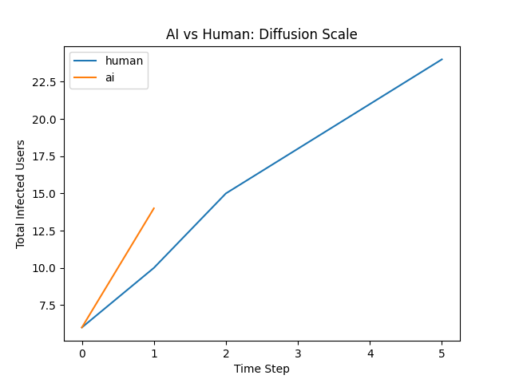
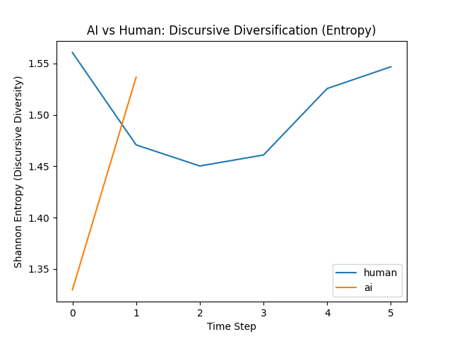

# AI-Assisted Governmentality Simulation
### Diffusion Scaling and Discursive Diversification under Generative Production

This repository contains a computational prototype that operationalizes AI-assisted anti-feminist discourse production as a socio-technical scaling process.

The model compares two production regimes:
- Human production mode (lower content rate, lower stylistic variation)
- AI-assisted production mode (higher production rate, higher template mutation)

It simulates how these regimes interact with platform-like network structures to produce differences in:
- Diffusion scale (total infected users)
- Discursive diversification (measured by Shannon entropy across six governmentality categories)

---

## Theoretical Motivation

Generative AI systems may not only increase content volume but also transform discursive governance structures by enabling rapid stylistic rewriting and template-based reproduction.

This prototype treats AI not as a detection problem, but as a production regime shift.

---

## Operationalization

| Theoretical Concept | Computational Representation |
|---------------------|-----------------------------|
| AI-assisted scaling | Higher production_rate |
| Template rewriting | Higher mutation probability |
| Governmentality categories | Six categorical labels |
| Diversification | Shannon entropy |
| Platform visibility | Scale-free network |
| Cascade dynamics | Independent Cascade diffusion |

The six governmentality-inspired discourse categories include:
- normative_appeal
- moralization
- problematization
- subject_positions
- conduct_of_conduct
- regimes_of_truth

Each infected node carries a category label, allowing entropy tracking over time.

---

## Core Experiment

Main script:
- src/ai_vs_human_entropy.py

Outputs:
- results/ai_vs_human_timeseries.csv
- results/ai_vs_human_infected.png
- results/ai_vs_human_entropy.png

### Diffusion Scale


### Discursive Diversification


---

## How to Run

```bash
python3 -m venv .venv
source .venv/bin/activate
pip install -r requirements.txt
python src/ai_vs_human_entropy.py---

Structural Break Design (Human → AI Regime Shift)

To align the simulation with an interrupted time-series logic, the model includes a structural break experiment that simulates the diffusion of generative AI after a temporal threshold.

The experiment introduces a regime shift at a predefined time step:
	•	For t < break_t: Human production regime
	•	For t ≥ break_t: AI-assisted production regime

The regime shift modifies:
	•	Production rate
	•	Diffusion probability
	•	Category mutation rate

This allows the model to approximate a post-2023 AI diffusion scenario in which generative systems alter the scale and diversification dynamics of discourse production.

The structural break experiment is implemented in:

src/structural_break.py

Outputs include:
	•	results/structural_break_timeseries.csv
	•	figures/structural_break_infected.png
	•	figures/structural_break_entropy.png

The vertical dashed line in the plots marks the regime transition point.

This design provides a computational analogue to segmented regression approaches used in interrupted time-series analysis, allowing visual inspection of slope changes and diversification shifts following AI adoption.

